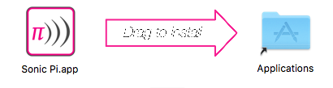
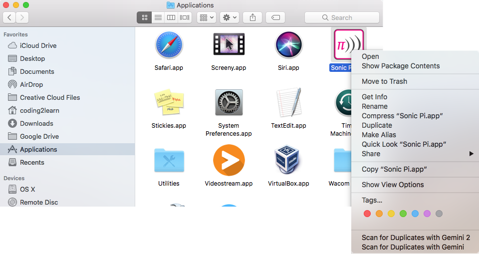
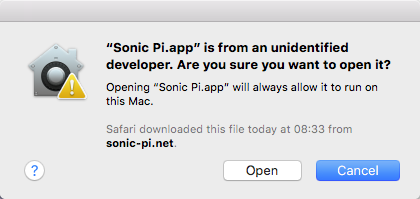

## تثبيت Sonic Pi على نظام Windows

- في مستعرض ويب، انتقل إلى [sonic-pi.net](https://sonic-pi.net/)

- انقر فوق زر **Windows** الموجود في أسفل الصفحة.


- انقر فوق زر **Windows 10 (64 bit) MSI Installer** اذا كنت تستخدم Windows 10.


- في مجلد التنزيلات Downloads، انقر نقرًا مزدوجًا فوق `msi` ملف.


- اقبل الشروط والأحكام ثم انقر فوق **Install**.


- انقر فوق **Finish** لإكمال التثبيت وتشغيل Sonic Pi.


## تثبيت Sonic Pi على نظام macOS

- في مستعرض ويب، انتقل إلى [ sonic-pi.net ](https://sonic-pi.net/)

- انقر فوق زر **macOS** الموجود في أسفل الصفحة.


- انقر فوق زر **Download**.


- في مجلد التنزيلات الخاص بك، انقر فوق ملف `.dmg` الذي قمت بتنزيله.


- اسحب ملف `Sonic Pi.app` في مجلد التطبيقات الخاص بك.



- افتح مجلد التطبيقات في Finder. اضغط واستمر بالضغط على مفتاح `Ctrl` وانقر على ملف `Sonic Pi.app`، ثم انقر فوق **Open**.



- انقر فوق **Open** عندما يُطلب منك ذلك.



## تثبيت Sonic Pi على Raspberry Pi

- اضغط على مفاتيح `Ctrl` ، `Alt` و `T` في نفس الوقت. سيؤدي هذا إلى فتح نافذة الاوامر.

- في النافذة أسطر الأوامر، اكتب:

```bash
sudo apt update && sudo apt install sonic-pi -y
```

