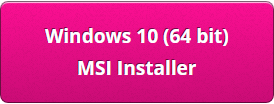

## Instal·lació de Sonic Pi a Windows

- En un navegador web, ves a [sonic-pi.net](https://sonic-pi.net/)

- Fes clic al botó **Windows** al final de la pàgina.


- Click the **Windows 10 (64 bit) Download MSI Installer** button.



- A la carpeta de descàrregues, fes doble clic al fitxer `msi`.


- Accepta els termes i les condicions i, a continuació, fes clic a **Install**.


- Fes clic a **Finish** per finalitzar la instal·lació i executar Sonic Pi.


## Instal·lació de Sonic Pi a macOS

- En un navegador web, ves a [sonic-pi.net](https://sonic-pi.net/)

- Fes clic al botó **macOS** al final de la pàgina.


- Fes clic al botó **Download**.


- Al directori de descàrregues, fes clic al fitxer `.dmg` que has baixat.


- Arrossega el fitxer `Sonic Pi.app` al directori d'aplicacions.


- Obre el directori d'Aplicacions a Finder. Mantingues premuda la tecla `Ctrl` i fes clic a l'arxiu `Sonic Pi.app`, després fes clic a **Obrir**.


- Fes clic a **Obrir** quan se't pregunti.


## Instal·lació de Sonic Pi a la Raspberry Pi

- Prem les tecles `Ctrl`, `Alt` i `T` al mateix temps. Això obrirà una finestra del terminal.

- A la finestra del terminal, escriu:

```bash
sudo apt update && sudo apt install sonic-pi -y
```

