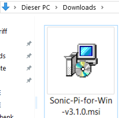

## Sonic Pi unter Windows installieren

- Navigiere im Webbrowser zu [sonic-pi.net](https://sonic-pi.net/)

- Klicke auf die **Windows** Schaltfläche am Ende der Seite.


- Klicke auf die **Windows 10 (64 bit) MSI Installer** Schaltfläche.


- Doppelklicke die `msi` Datei in deinem Downloadsordner.



- Akzeptiere die Allgemeinen Geschäftsbedingungen und klicke dann auf **Install**.


- Klicke auf **Finish** um die Installation abzuschließen und Sonic Pi zu starten.


## Sonic Pi unter masOS installieren

- Navigiere im Webbrowser zu [sonic-pi.net](https://sonic-pi.net/)

- Klicke auf die **masOS** Schaltfläche am Ende der Seite.


- Klicke auf die **Download** Schaltfläche.


- Klicke in deinem Download-Verzeichnis auf die `.dmg` Datei, die du heruntergeladen hast.


- Ziehe die `Sonic Pi.app` Datei in dein Anwendungsverzeichnis.


- Öffne dein Anwendungsverzeichnis im Finder. Halte die `Strg-Taste gedrückt` Taste und klicke auf die `Sonic Pi.app`. Klicke dann auf **Öffnen**.


- Klicke auf **Öffnen** wenn du dazu aufgefordert wirst.


## Sonic Pi auf Raspberry Pi installieren

- Drücke die `Strg-`, `Alt-` und `T-`Taste gleichzeitig. Dies öffnet ein Terminalfenster.

- Gib im Terminalfenster Folgendes ein:

```bash
sudo apt update && sudo apt installiere sonic-pi -y
```

