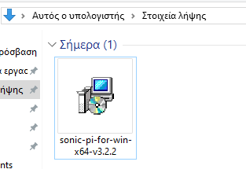
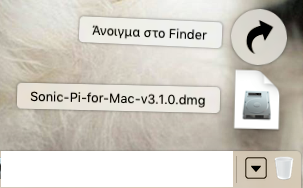
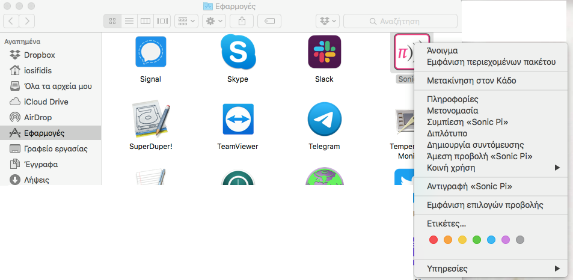
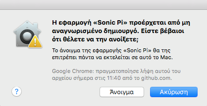

## Εγκατάσταση του Sonic Pi στα Windows

- Σε ένα πρόγραμμα περιήγησης ιστού, μπες στο [sonic-pi.net](https://sonic-pi.net/)

- Κάνε κλικ στο κουμπί **Windows** στο κάτω μέρος της σελίδας.


- Κάνε κλικ στο κουμπί **Windows 10 (64 bit) MSI Installer**.


- Στο φάκελο "Στοιχεία λήψης", κάνε διπλό κλικ στο αρχείο `msi`.



- Αποδέξου τους όρους και τις προϋποθέσεις και μετά κάνε κλικ στην **Εγκατάσταση**.


- Κάνε κλικ στο **Τέλος** για να ολοκληρώσεις την εγκατάσταση και να ξεκινήσεις το Sonic Pi.


## Εγκατάσταση του Sonic Pi στο macOS

- Σε ένα πρόγραμμα περιήγησης ιστού, μπες στο [sonic-pi.net](https://sonic-pi.net/)

- Κάνε κλικ στο κουμπί **macOS** στο κάτω μέρος της σελίδας.


- Κάνε κλικ στο κουμπί **Download**.


- Στον κατάλογο Λήψεις, κάνε κλικ στο αρχείο `.dmg` που έχεις κατεβάσει.



- Σύρε το αρχείο `Sonic Pi.app` στον κατάλογο Εφαρμογές σου.


- Άνοιξε τον κατάλογο εφαρμογών σου στο Finder. Κράτησε πατημένο το `Ctrl` και κάνε κλικ στο αρχείο `Sonic Pi.app` και, στη συνέχεια, κάνε κλικ στο **Άνοιγμα**.



- Κάνε κλικ στο **Άνοιγμα** όταν εμφανιστεί.



## Εγκατάσταση του Sonic Pi στο Raspberry Pi

- Πάτησε τα πλήκτρα `Ctrl`, `Alt` και `Τ` ταυτόχρονα. Αυτό θα ανοίξει ένα παράθυρο τερματικού.

- Στο παράθυρο του τερματικού, πληκτρολόγησε:

```bash
sudo apt update && sudo apt install sonic-pi -y
```

