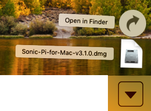
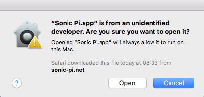

## Install Sonic Pi on Windows

- In a web browser, navigate to [sonic-pi.net](https://sonic-pi.net/)

- Click the **Windows** button at the bottom of the page.


- Click the **Download MSI Installer** button.


- In your Downloads folder, double-click the `msi` file.


- Accept the terms and conditions and then click **Install**.


- Click **Finish** to complete the installation and launch Sonic Pi.


## Install Sonic Pi on macOS

- In a web browser, navigate to [sonic-pi.net](https://sonic-pi.net/)

- Click the **macOS** button at the bottom of the page.


- Click the **Download** button.


- In your Downloads directory, click on the `.dmg` file that you have downloaded.



- Drag the `Sonic Pi.app` file into your Applications directory.


- Open your Applications directory in Finder. Hold down the `Ctrl` key and click on the `Sonic Pi.app` file, then click **Open**.


- Click **Open** when prompted.



## Install Sonic Pi on Raspberry Pi

- Press the `Ctrl`, `Alt` and `T` keys at the same time. This will open a terminal window.

- In the terminal window, type:

```bash
sudo apt update && sudo apt install sonic-pi -y
```

