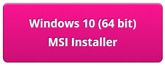

## Install Sonic Pi on Windows

--- task ---
In a web browser, navigate to [sonic-pi.net](https://sonic-pi.net/)
--- /task ---

--- task ---
Click the **Windows** button at the bottom of the page.

--- /task ---

--- task ---
Click the **Download MSI Installer** button.

--- /task ---

--- task ---
In your Downloads folder, double-click the `msi` file.
[windows1](images/windows1.png)
--- /task ---

--- task ---
Accept the terms and conditions and then click **Install**.

--- /task ---

--- task ---
Click **Finish** to complete the installation and launch Sonic Pi.

--- /task ---

## Install Sonic Pi on macOS

--- task ---
In a web browser, navigate to [sonic-pi.net](https://sonic-pi.net/)
--- /task ---

--- task ---
Click the **macOS** button at the bottom of the page.

--- /task ---

--- task ---
Click the **Download** button.

--- /task ---

--- task ---
In your Downloads directory, click on the `.dmg` file that you have downloaded.

--- /task ---

--- task ---
Drag the `Sonic Pi.app` file into your Applications directory.

--- /task ---

--- task ---
Open your Applications directory in Finder. Hold down the `Ctrl` key and click on the `Sonic Pi.app` file, then click **Open**.

--- /task ---

--- task ---
Click **Open** when prompted.

--- /task ---

## Install Sonic Pi on Raspberry Pi

--- task ---
Press the `Ctrl`, `Alt` and `T` keys at the same time. This will open a terminal window.
--- /task ---

--- task ---
In the terminal window, type:

```bash
sudo apt update && sudo apt install sonic-pi -y
```
--- /task ---
