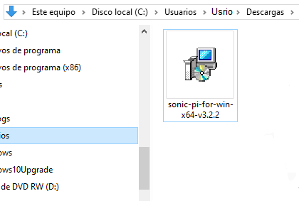
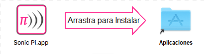
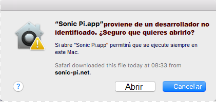

## Instalar Sonic Pi en Windows

- En un navegador web, ve a [sonic-pi.net](https://sonic-pi.net/)

- Haz clic en el botón **Windows** en la parte inferior de la página.


- Haz clic en el botón **Windows 10 (64 bit) Download MSI Installer**.


- En tu carpeta de Descargas, haz doble clic en el archivo `msi`.



- Acepta los términos y condiciones y luego haz clic en **Install**.


- Haz clic en **Finish** para completar la instalación y ejecutar Sonic Pi.


## Instalar Sonic Pi en macOS

- En un navegador web, ve a [sonic-pi.net](https://sonic-pi.net/)

- Haz clic en el botón **macOS** en la parte inferior de la página.


- Haz clic en el botón **Download**.


- En tu directorio de Descargas, haz clic en el archivo `.dmg` que has descargado.


- Arrastra el archivo `Sonic Pi.app` a tu directorio de aplicaciones.



- Abre tu directorio de aplicaciones en Finder. Mantén presionada la tecla `Ctrl` y haz clic en el archivo `Sonic Pi.app`, luego haz clic en **Abrir**.


- Haz clic en **Abrir** cuando se muestre.



## Instalar Sonic Pi en Raspberry Pi

- Presiona las teclas `Ctrl`, `Alt` y `T` al mismo tiempo. Esto abrirá una ventana de terminal.

- En la ventana de terminal, escribe:

```bash
sudo apt update && sudo apt install sonic-pi -y
```

