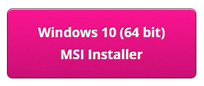
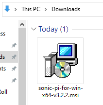
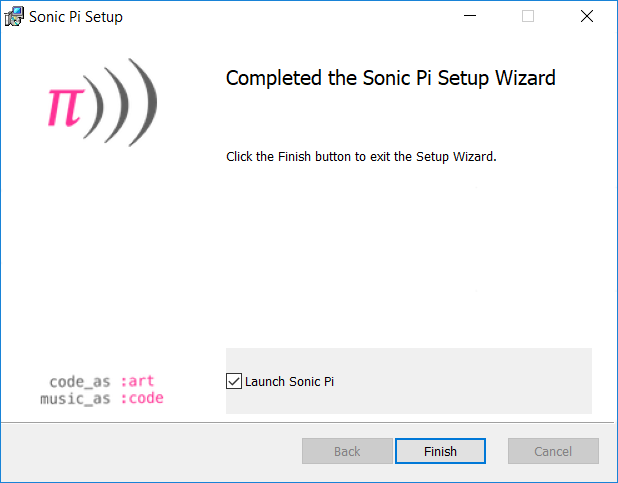

## Installer Sonic Pi sur Windows

- Dans un navigateur Web, va sur [sonic-pi.net](https://sonic-pi.net/)

- Clique sur le bouton **Windows** en bas de la page.


- Clique sur le bouton **Windows 10 (64 bit) MSI Installer**.



- Dans ton dossier «Téléchargements», double-clique sur le fichier `msi`.



- Accepte les termes et conditions, puis clique sur **Install**.


- Clique sur **Finish** pour terminer l'installation et lancer Sonic Pi.




## Installer Sonic Pi sur macOS

- Dans un navigateur Web, va sur [sonic-pi.net](https://sonic-pi.net/)

- Clique sur le bouton **macOS** en bas de la page.


- Clique sur le bouton **Download**.


- Dans ton dossier «Téléchargements», clique sur le fichier `.dmg` que tu as téléchargé.


- Fais glisser le fichier `Sonic Pi.app` dans ton dossier «Applications».


- Ouvre ton dossier «Applications» dans le Finder. Maintiens la touche `Ctrl` et clique sur le fichier `Sonic Pi.app`, puis clique sur **Ouvrir**.


- Clique sur **Ouvrir** lorsque tu y es invité.


## Installer Sonic Pi sur Raspberry Pi

- Appuie sur les touches `Ctrl`, `Alt` et `T` en même temps. Cela ouvrira une fenêtre de terminal.

- Dans la fenêtre du terminal, tape:

```bash
sudo apt update && sudo apt install sonic-pi -y
```

