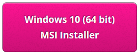
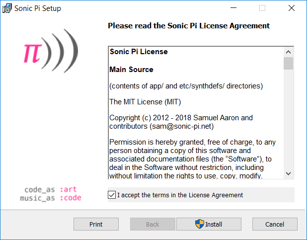
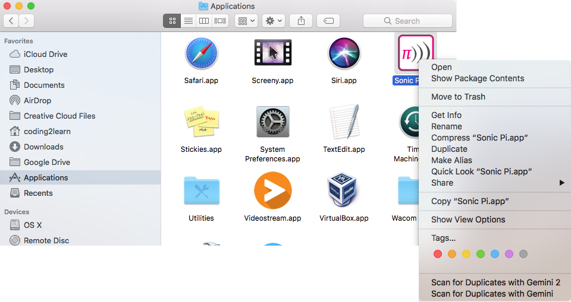

## Windows पर Sonic Pi इनस्टॉल करना

- एक वेब ब्राउज़र में [sonic-pi.net](https://sonic-pi.net/) पर जाएं

- पेज के निचले हिस्से में **Windows** पर क्लिक करें ।


- **Windows 10 (64 bit) Download MSI Installer** बटन पर क्लिक करें ।



- अपने डौन्लोडस (Downloads) फ़ोल्डर में `msi` फ़ाइल पर दो बार क्लिक करें ।


- नियम और शर्तें स्वीकार करें (Accept the terms and conditions) और फिर **Install** पर क्लिक करें ।



- इंस्टालेशन पूरा करेने के लिए **Finish** बटन दबाएं और Sonic Pi लॉन्च करें।


## Sonic Pi को macOS पर इनस्टॉल करना

- एक वेब ब्राउज़र में [sonic-pi.net](https://sonic-pi.net/) पर जाएं

- पेज के निचले हिस्से में **macOS** पर क्लिक करें ।


- **Download** बटन पर क्लिक करें।


- अपने डाउनलोड डायरेक्टरी (Downloads directory) में `.dmg` file पर क्लिक करें जिसको आपने अभी डाउनलोड किया है ।


- `Sonic Pi.app` file को अपने ऍप्लिकेशन्स डायरेक्टरी (Applications directory) में खींचें ।


- अपने Finder में ऍप्लिकेशन्स डायरेक्टरी खोलें । `Ctrl` कुंजी को दबाए रखें  और ` Sonic Pi.app` file पर क्लिक करें और फिर **Open** पर क्लिक करें।



- **Open** पर क्लिक करें जब स्क्रीन पे आपको बोला जाये ।


## Sonic Pi को Raspberry Pi पर इनस्टॉल करना

- `Ctrl`, `Alt` और `T` कुंजियों को एक ही साथ में दबाएं । यह एक टर्मिनल विंडो खोलेगा।

- टर्मिनल विंडो में टाइप करें:

```bash
sudo apt update && sudo apt install sonic-pi -y
```

