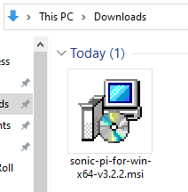

## Installare Sonic Pi su Windows

- In un browser, vai su [sonic-pi.net](https://sonic-pi.net/)

- Fai clic sul pulsante **Windows** nella parte inferiore della pagina.


- Fai clic su **Windows 10 (64 bit) MSI Installer** (o il più adatto alla tua versione di Windows).


- Nella tua cartella Download, fai doppio clic sul file `msi` scaricato.



- Accetta i termini e le condizioni, quindi fai clic su **Install**.


- Fai clic su **Finish** per completare l'installazione e avviare Sonic Pi.


## Installare Sonic Pi su macOS

- In un browser, vai su [sonic-pi.net](https://sonic-pi.net/)

- Fai clic sul pulsante **macOS** nella parte inferiore della pagina.


- Fai clic sul pulsante **Download**.


- Nella tua cartella Download, fai clic sul file `.dmg` che hai scaricato.


- Trascina il file `Sonic Pi.app` nella cartella Applicazioni.


- Apri la tua cartella Applicazioni nel Finder. Tieni premuto il tasto `Ctrl` tasto e fai clic sul file `Sonic Pi.app`, quindi fai clic su **Apri**.


- Fai clic su **Apri** quando richiesto.


## Installare Sonic Pi su Raspberry Pi

- Premi i tasti `Ctrl`, `Alt` e `T` allo stesso tempo. Questo aprirà una finestra terminale.

- Nella finestra del terminale, digita:

```bash
sudo apt update && sudo apt install sonic-pi -y
```

