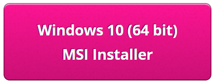
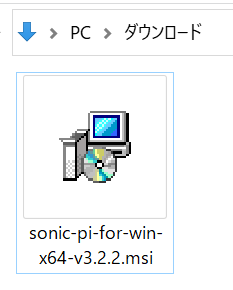
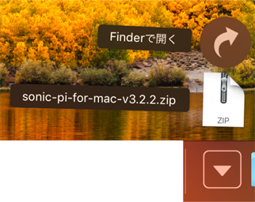
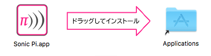
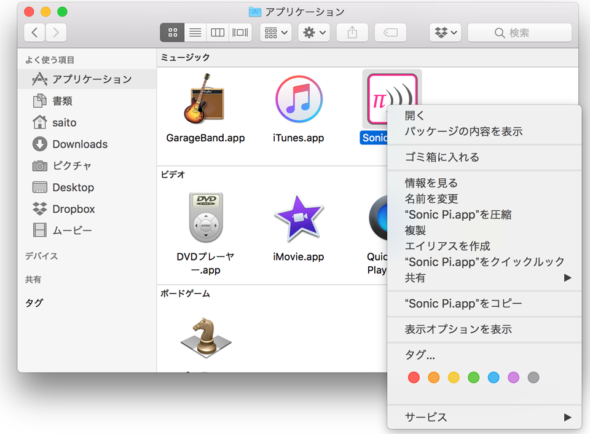
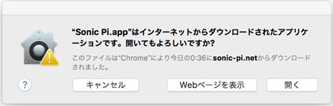

## WindowsにSonic Piをインストールする

- Webブラウザで [sonic-pi.net](https://sonic-pi.net/)に移動します。

- ページの下の方にある**Windows**ボタンをクリックします。


- **Windows 10 (64 bit) Download MSI Installer**ボタンをクリックします。.



- ダウンロードフォルダーにある `msi`ファイルをダブルクリックします。.



- 利用規約に同意して**Install**を押します。.


- **Finish**を押してインストールを完了し、Sonic Piを起動します。


## macOSにSonic Piをインストールする

- Webブラウザで[sonic-pi.net](https://sonic-pi.net/)に移動します。

- ページの下の方にある**macOs**ボタンを押します。


- **Download**ボタンを押します。


- ダウンロードフォルダにダウンロードした`.dmg`ファイルをクリックします。



- `Sonic Pi.app`ファイルをクリックします。



- Finderでアプリケーションフォルダを開きます。`Ctrl`キーを押しながら`Sonic Pi.app`ファイルをクリックし、<1>開く</1>をクリックします。



- プロンプトが表示されたら**開く**を押します。



## Raspberry PiにSonic Piをインストールする

- `Ctrl`、`Alt`、`T`キーを同時に押します。ターミナルウィンドウが開きます。

- ターミナルウィンドウで以下を入力します：

```bash
sudo apt update && sudo apt install sonic-pi -y
```

