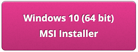
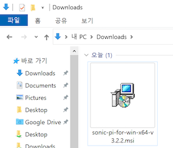
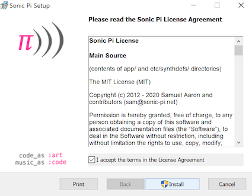
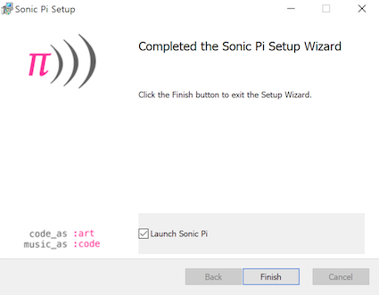
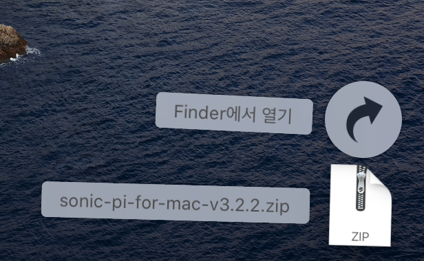
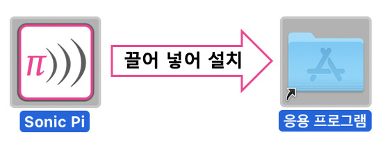
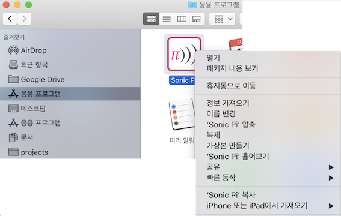
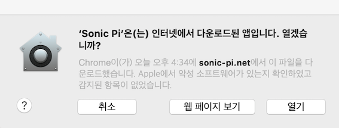

## 윈도우 환경에 Sonic Pi 설치하기

- 웹 브라우저에서 [sonic-pi.net](https://sonic-pi.net/)으로 이동합니다.

- 페이지의 아래쪽에 있는 **Windows** 버튼을 클릭합니다.


- **Windows 10 (64 bit) Installer** 버튼을 클릭하여 설치파일을 다운로드합니다.



- 다운로드 폴더에서 `msi` 파일을 두 번 클릭하여 실행시킵니다.



- "I accept the terms in the License Agreement"에 체크하고 **Install** 버튼을 클릭하여 설치를 시작합니다.



- **Finish** 버튼을 클릭해서 설치를 마무리 하고 소닉 파이를 실행시킵니다.




## 맥 환경에서 Sonic Pi 설치하기

- 웹 브라우저에서 [sonic-pi.net](https://sonic-pi.net/)으로 이동합니다.

- 페이지의 아래쪽에 있는 **macOS** 버튼을 클릭합니다.


- **Download** 버튼을 클릭하여 설치파일을 다운로드합니다.


- 다운로드 폴더에서 `.zip`파일을 더블 클릭하여 압축을 해제하여 "Sonic Pi" 앱을 꺼냅니다.



- `Sonic Pi.app` 파일을 컴퓨터의 응용프로그램 폴더에 넣습니다.



- 탐색기에서 응용프로그램 디렉토리를 여세요. `Control` 키를 누른 상태로  `Sonic Pi.pp`을 클릭하고  **열기**를 선택하여 앱을 실행시킵니다.



- 메시지 창이 표시되면 **열기** 버튼을 클릭합니다.



## 라즈베리 파이에 Sonic Pi 설치하기

- `Ctrl`, `Alt` 와 `T` 키를 동시에 누릅니다. 터미널 윈도우가 열립니다.

- 터미널 창에 다음 명령어를 입력하십시오.

```bash
sudo apt update && sudo apt install sonic-pi -y

```

