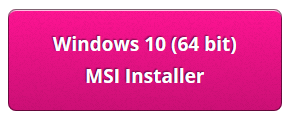
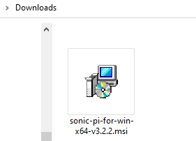
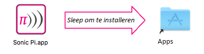

## Installeer Sonic Pi op Windows

- Open je webbrowser en ga naar [sonic-pi.net](https://sonic-pi.net/)

- Klik op de **Windows** knop onderaan de pagina.


- Click the **Windows 10 (64 bit) Download MSI Installer** button.



- Dubbelklik in je map Downloads op het `msi` bestand.



- Accepteer de algemene voorwaarden en klik vervolgens op **Install**.


- Klik op **Finish** om de installatie te voltooien en Sonic Pi te starten.


## Installeer Sonic Pi op macOS

- Open je webbrowser en ga naar [sonic-pi.net](https://sonic-pi.net/)

- Klik op de **macOS **knop onderaan de pagina.


- Klik op de **Download** knop.


- Klik in je map Downloads op het `.dmg` bestand dat je hebt gedownload.


- Sleep het `Sonic Pi.app` bestand naar je map Apps.



- Open je map Apps in Finder. Houd de `Ctrl` toets ingedrukt en klik op het `Sonic Pi.app` bestand en klik vervolgens op **Openen**.


- Klik op **Openen** als daarom gevraagd wordt.


## Installeer Sonic Pi op Raspberry Pi

- Druk tegelijkertijd op de `Ctrl`, `Alt` en `T` toetsen. Dit opent een terminalvenster.

- Typ in het terminalvenster:

```bash
sudo apt update && sudo apt install sonic-pi -y
```

