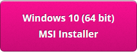
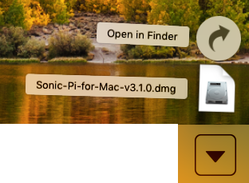

## Zainstaluj Sonic Pi w systemie Windows

- W przeglądarce internetowej przejdź do [sonic-pi.net](https://sonic-pi.net/)

- Kliknij przycisk **Windows** u dołu strony.


- Kliknij przycisk **Download MSI Installer**.



- W folderze Pobrane kliknij dwukrotnie ikonę pliku `msi`.


- Zaakceptuj warunki, a następnie kliknij **Install**.


- Kliknij **Finish** aby zakończyć instalację i uruchomić Sonic Pi.


## Zainstaluj Sonic Pi w systemie macOS

- W przeglądarce internetowej przejdź do [sonic-pi.net](https://sonic-pi.net/)

- Kliknij przycisk **macOS** u dołu strony.


- Kliknij przycisk **Download**.


- W katalogu Pobrane kliknij plik `.dmg`, który pobrano.



- Przeciągnij plik `Sonic Pi.apk` do katalogu aplikacji.


- Otwórz katalog aplikacji w Finderze. Przytrzymaj klawisz < code>Ctrl</code> i kliknij plik `Sonic Pi.app`, a następnie kliknij przycisk **Otwórz**.


- Kliknij **Otwórz** gdy pojawi się monit.


## Zainstaluj Sonic Pi na Raspberry Pi

- Wciśnij klawisze `Ctrl`, `Alt` i `T` w tym samym momencie. Spowoduje to otwarcie okna terminala.

- W oknie terminala wpisz:

```bash
sudo apt update && sudo apt install sonic-pi -y
```

