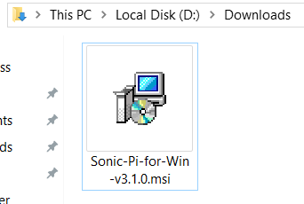
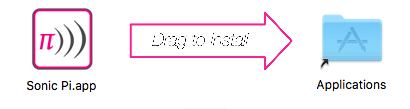

## Instale o Sonic Pi no Windows

- Em um navegador da web, acesse [sonic-pi.net](https://sonic-pi.net/)

- Clique no botão **Windows** na parte inferior da página.


- Clique no botão **Windows 10 (64 bit) MSI Installer**.


- Na sua pasta Downloads, clique duas vezes no arquivo `msi`.



- Aceite os termos e condições e clique em **Install**.


- Clique em **Finish** para concluir a instalação e iniciar o Sonic Pi.


## Instale o Sonic Pi no macOS

- Em um navegador da web, acesse [sonic-pi.net](https://sonic-pi.net/)

- Clique no botão **macOS** na parte inferior da página.


- Clique no botão **Download**.


- Na diretório Downloads, clique no arquivo `.dmg` que você baixou.


- Arraste o `Sonic Pi.app` para o diretório de aplicativos.



- Abra o diretório de aplicativos no Finder. Mantenha pressionada a tecla `Ctrl` e clique no arquivo `Sonic Pi.app`, depois clique em **Abrir**.


- Clique em **Abrir** quando for solicitado.


## Instale o Sonic Pi no Raspberry Pi

- Pressione as teclas `Ctrl`, `Alt` e `T` ao mesmo tempo. Isso abrirá uma janela do terminal.

- Na janela do terminal, digite:

```bash
sudo apt update && sudo apt install sonic-pi -y
```

