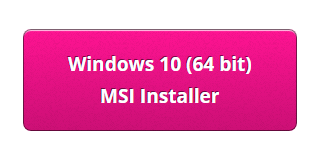
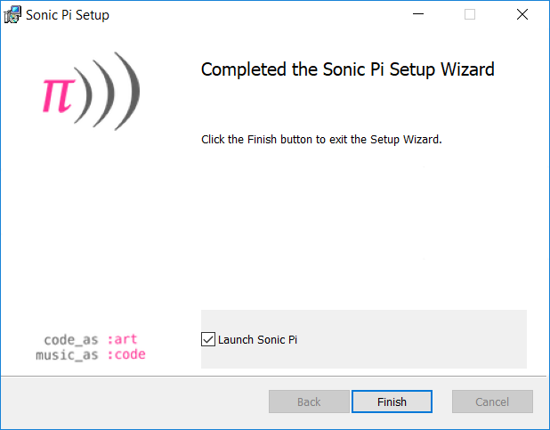

## Instalează Sonic Pi pe Windows

- Într-un browser web, navighează [sonic-pi.net](https://sonic-pi.net/)

- Dă click pe butonul **Windows** în partea de jos a paginii.


- Dă click pe butonul **Windows 10 (64 bit) MSI Installer**.



- În folder-ul Downloads (Descărcări), dă click pe fișierul `msi`.


- Acceptă termenii și condițiile, iar apoi dă click pe **Install**.


- Dă click pe **Finish** pentru a completa instalarea și a rula Sonic Pi.




## Instalează Sonic Pi pe macOS

- Într-un browser web, navighează [sonic-pi.net](https://sonic-pi.net/)

- Dă click pe butonul **macOS** în partea de jos a paginii.


- Dă click pe butonul **Download**.


- În folder-ul Downloads (Descărcări), dă click pe fișierul `.dmg` pe care l-ai descărcat.


- Trage fișierul `Sonic Pi.app` în folder-ul tău pentru Aplicații.


- Deschide folder-ul tău Aplicații în Finder. Ține apăsată tasta `Ctrl` și dă click pe fișierul `Sonic Pi.app`, iar apoi dă click pe **Open**.


- Dă click pe **Open** când ți se cere acest lucru.


## Instalează Sonic Pi pe Raspberry Pi

- Apasă tastele `Ctrl`, `Alt` și `T` simultan. Acest lucru va deschide o fereastră terminal.

- În fereastra terminalului, tastează:

```bash
sudo apt update && sudo apt install sonic-pi -y
```

