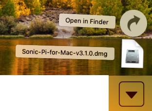

## Namesti Sonic Pi v Windowsih

- V spletnem brskalniku pojdi na [sonic-pi.net](https://sonic-pi.net/)

- Klikni na gumb **Windows** na dnu strani.


- Klikni na gumb **Windows 10 (64 bit) MSI Installer**.


- V mapi Prenos, dvakrat klikni na datoteko `msi`.


- Sprejmi pogoje uporabe in klikni na **Install**.


- Klikni **Finish**, da zaključiš namestitev in zaženeš Sonic Pi.


## Namesti Sonic Pi na macOS

- V spletnem brskalniku pojdi na [sonic-pi.net](https://sonic-pi.net/)

- Klikni na gumb **macOS** na dnu strani.


- Klikni na gumb **Download**.


- V imeniku Downloads klikni na prenešeno `.dmg` datoteko.



- Potegni datoteko `Sonic Pi.app` v mapo Applications.


- V Finder-ju odpri mapo Applications. Drži tipko `Ctrl` in klikni na datoteko `Sonic Pi.app`, nato pa klikni **Open**.


- Ob pozivu klikni na **Open**.


## Namesti Sonic Pi na Raspberry Pi

- Hkrati pritisni tipke `Ctrl`, `Alt` in `T`. To bo odprlo okno terminala.

- V okno terminala vnesi:

```bash
sudo apt update && sudo apt install sonic-pi -y
```

