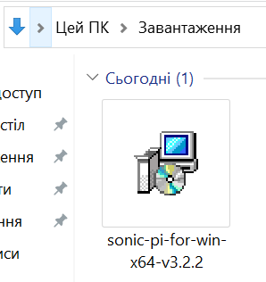
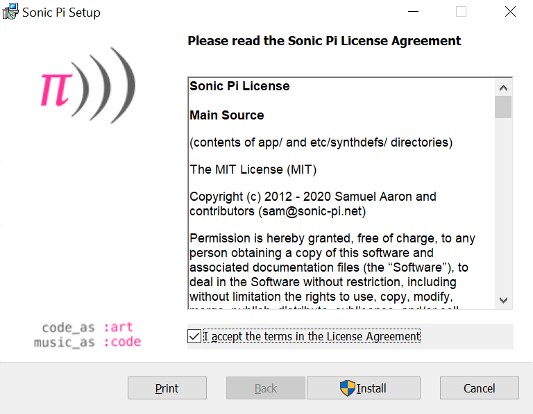
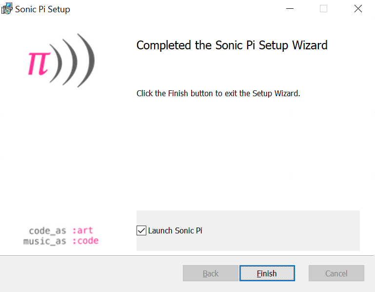
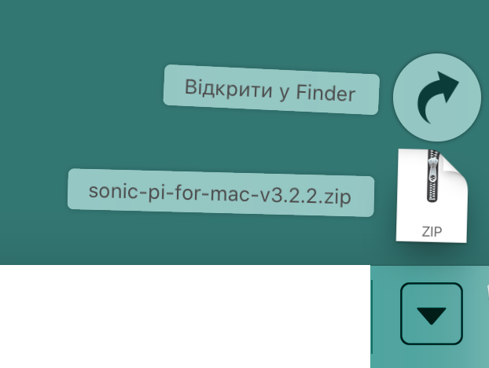
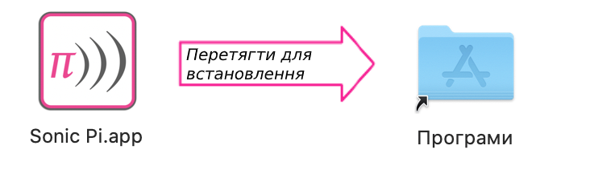
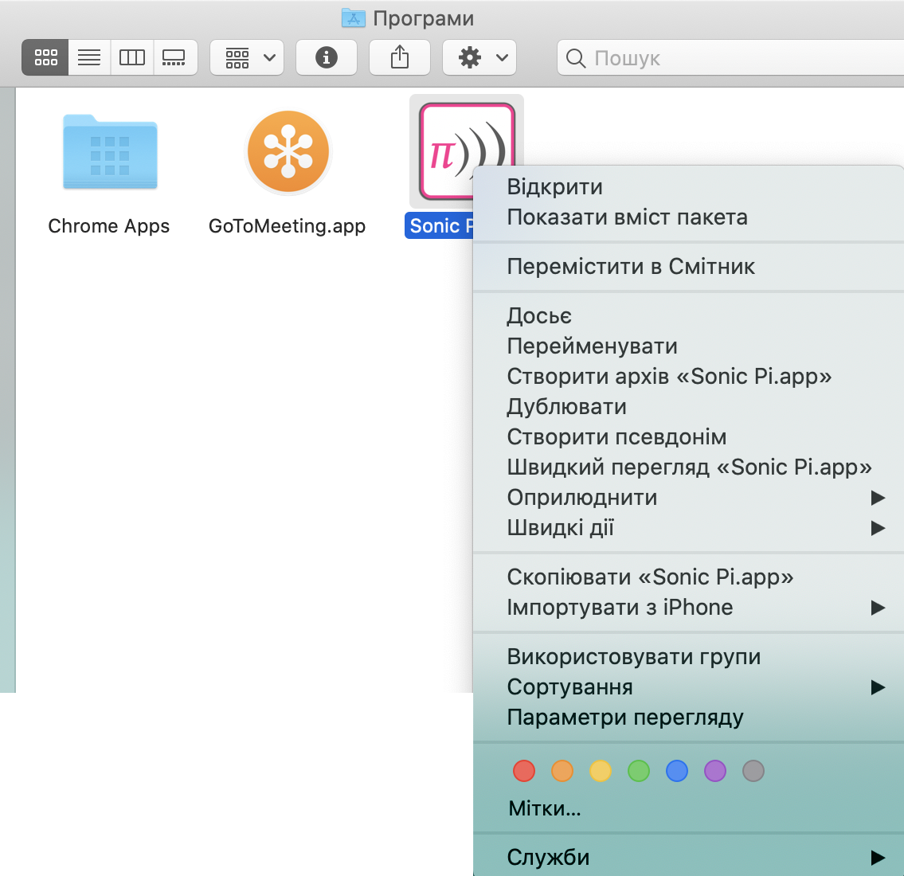
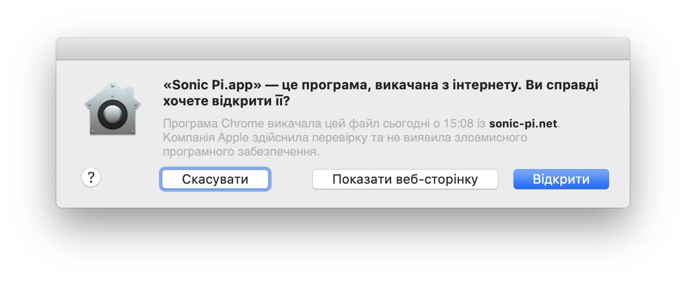

## Встановлення Sonic Pi у Windows

- У будь-якому веббраузері перейди на [sonic-pi.net](https://sonic-pi.net/)

- Натисни кнопку **Windows** внизу сторінки.


- Натисни кнопку **Windows 10 (64 bit) MSI Installer**.


- У папці завантажень зроби подвійний клік на цьому файлі `msi`.



- Прийми умови користування та натисни **Install**.



- Натисни **Finish** для завершення встановлення та запуску Sonic Pi.




## Встановлення Sonic Pi у macOS

- У будь-якому веббраузері перейди на [sonic-pi.net](https://sonic-pi.net/).

- Натисни кнопку **macOS** внизу сторінки.


- Натисни кнопку **Download**.


- У папці завантажень клікни на збережений файл `.dmg`.



- Перетягни файл `Sonic Pi.app` у папку Програми (Applications).



- Відкрий папку Програми (Applications) у Finder. Утримуючи клавішу `Ctrl`, клікни на файл `Sonic Pi.app`, далі клікни **Відкрити**.



- При запиті натисни **Відкрити**.



## Встановлення Sonic Pi на Raspberry Pi

- Одночасно натисни клавіші `Ctrl`, `Alt` та `T`. Таким чином відкриється вікно терміналу.

- У вікні терміналу введи:

```bash
sudo apt update && sudo apt install sonic-pi -y
```

