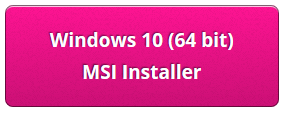
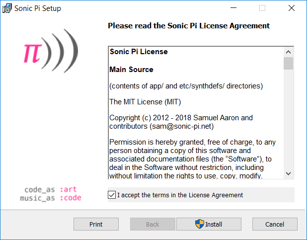
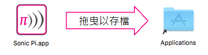
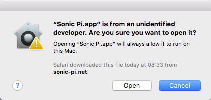

## 在Windows上安裝Sonic Pi

- 在瀏覽器中，輸入[ sonic-pi.net ](https://sonic-pi.net/)

- 在頁面最底部點擊 **Windows**。


- 點擊** Windows 10 (64 bit) Download MSI Installer **按鈕。



- 在“下載”文件夾中，雙擊` msi `檔案。


- 接受條款和條件，然後點擊**Install** 。



- 點擊  **Finish**完成安裝並啟動Sonic Pi。


## 在macOS上安裝Sonic Pi

- 在瀏覽器中，輸入[sonic-pi.net](https://sonic-pi.net/)

- 在頁面最底部點擊 **macOS**。


- 點擊 **Download** 按鈕。


- 在您的下載目錄中，點擊以下載的 `.dmg` 檔案


- 拖曳 ` Sonic Pi.app `文件放入“應用程序”目錄。



- 在Finder中打開“應用程序”目錄。 按住`Ctrl`鍵，然後點擊檔案` Sonic Pi.app `，然後點擊 **開啟**。


- 點擊**開啟**當顯示提示時。



## 在Raspberry Pi上安裝Sonic Pi

- 同時按住 `Ctrl`, `Alt` 跟 `T`。 這將會開啟一個終端機。

- 在終端機視窗中，輸入：

```bash
sudo apt update && sudo apt install sonic-pi -y
```

